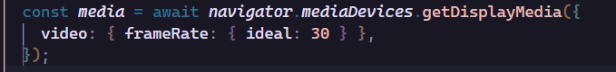
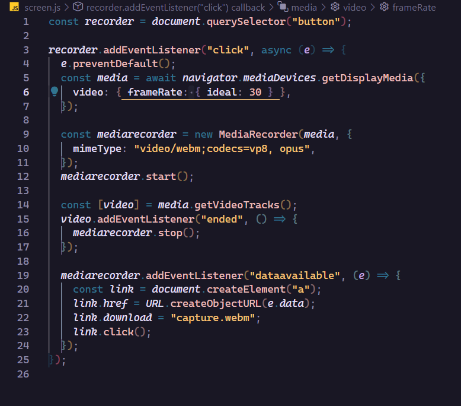

# Screen recorder

- how scree recorder works

> screen recorder, is a screen recorder made in js that allows you to record your screen at a rate of 30 frames per second, you can stop recording whenever you want and the recording will automatically be saved on your PC in the following path /download/capture. webm

- screen recorder uses some external library to manage recording and frames

> no screen recorder does not depend on any library for recording management, everything is done natively with the browser API

- the audio is also recorded?

> No, currently the function of being able to record audio has not been incorporated, along with the video.

- I can take the code and make my own screen recorder?

> Of course, this repository is open source, you can download and modify the code as much as you want, just don't forget to give the repo a little star to know what you liked

- I can contribute to the project?

> If anyone who wants can contribute and improve the app

- how to adjust resolution and frames

> With the Media Display what you do is that you choose the setting and the ideal frames for the recording, of course you can modify it and adjust it to taste

- example of how to use the browser api to record

- Thank you very much for stopping by here, if you liked the repository of your little star to know that you liked the repository

> created with ❤ by watercubz
